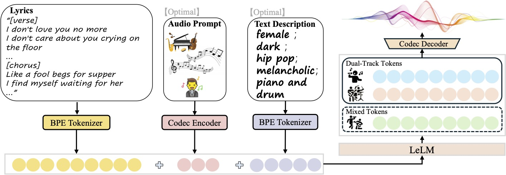

# SongGeneration
<p align="center"></p>
<p align="center">
    <a href="https://levo-demo.github.io/">Demo</a> &nbsp;|&nbsp; <a href="https://arxiv.org/abs/2506.07520">Paper</a>  &nbsp;|&nbsp; <a href="https://huggingface.co/waytan22/SongGeneration">Hugging Face</a>  &nbsp;|&nbsp; <a href="https://huggingface.co/spaces/waytan22/SongGeneration-LeVo">Space Demo</a>
</p>


This repository is the official code repository for LeVo: High-Quality Song Generation with Multi-Preference Alignment. In this repository, we provide the SongGeneration model, inference scripts, and checkpoints trained on the Million Song Dataset that support both Chinese and English.

## TODOs📋

- [ ] Update full time model.
- [ ] Update English enhanced model.
- [ ] Update Low memory usage model.
- [ ] Release finetuning scripts.

## Model Versions

|          Model           |                         HuggingFace                          |
| :----------------------: | :----------------------------------------------------------: |
|  SongGeneration-base   | <a href="https://huggingface.co/tencent/SongGeneration/tree/main/ckpt/songgeneration_base">v20250520</a> |
| SongGeneration-base(zh&en) |                         Coming soon                          |
| SongGeneration-full(zh&en) |                         Coming soon                          |

## Overview

We develop the SongGeneration model. It is an LM-based framework consisting of **LeLM** and a **music codec**. LeLM is capable of parallelly modeling two types of tokens: mixed tokens, which represent the combined audio of vocals and accompaniment to achieve vocal-instrument harmony, and dual-track tokens, which separately encode vocals and accompaniment for high-quality song generation. The music codec reconstructs the dual-track tokens into highfidelity music audio. SongGeneration significantly improves over the open-source music generation models and performs competitively with current state-of-the-art industry systems. For more details, please refer to our [paper](https://arxiv.org/abs/2506.07520).

 

## Installation

### Start from scatch

You can install the necessary dependencies using the `requirements.txt` file with Python>=3.8.12 and CUDA>=11.8:

```bash
pip install -r requirements.txt
pip install -r requirements_nodeps.txt --no-deps
```

Then install flash attention from git. For example, if you're using Python 3.10 and CUDA 12.0

```bash
pip install https://github.com/Dao-AILab/flash-attention/releases/download/v2.7.4.post1/flash_attn-2.7.4.post1+cu12torch2.6cxx11abiFALSE-cp310-cp310-linux_x86_64.whl
```

### Start with docker

```bash
docker pull juhayna/song-generation-levo:hf0613
docker run -it --gpus all --network=host juhayna/song-generation-levo:hf0613 /bin/bash
```

### Other deploy examples 

 - Windows platform with ComfyUI: https://github.com/smthemex/ComfyUI_SongGeneration
 - Windows installer: http://bilibili.com/video/BV1ATK8zQE8L/?vd_source=22cfc54298226c4161b1aff457d17585


## Inference

To ensure the model runs correctly, **please download all the required folders** from the original source at [Hugging Face](https://huggingface.co/waytan22/SongGeneration).

- Save the `ckpt` and `third_party` folder into the **root directory** of the project
- Save the the model's `ckpt` and `yaml` files into your desired checkpoint directory: `ckpt_path`（We provide multiple versions of model checkpoints. Please choose the version that best fits your needs and download the corresponding `ckpt` and `yaml` files accordingly.）

Once everything is set up, you can run the inference script using the following command:

```bash
sh generate.sh ckpt_path lyrics.jsonl output_path
```

If your GPU has less than 30GB or you encounter Out-of-Memory (OOM) errors, run the following command:

```bash
sh generate_lowmem.sh ckpt_path lyrics.jsonl output_path
```

- You may provides sample inputs in JSON Lines (`.jsonl`) format. Each line represents an individual song generation request. The model expects each input to contain the following fields:

  - `idx`: A unique identifier for the output song. It will be used as the name of the generated audio file.
  - `gt_lyric`:The lyrics to be used in generation. It must follow the format of `[Structure] Text`, where `Structure` defines the musical section (e.g., `[Verse]`, `[Chorus]`). See Input Guide.
  - `descriptions` : (Optional) You may customize the text prompt to guide the model’s generation. This can include attributes like gender, timbre, genre, emotion, instrument, and BPM. See Input Guide.
  - `prompt_audio_path`: (Optional) Path to a 10-second reference audio file. If provided, the model will generate a new song in a similar style to the given reference.

  - `auto_prompt_audio_type`: (Optional) Used only if `prompt_audio_path` is not provided. This allows the model to automatically select a reference audio from a predefined library based on a given style. Supported values include:
    - `'Pop'`, `'R&B'`, `'Dance'`, `'Jazz'`, `'Folk'`, `'Rock'`,`'Chinese Style'`, `'Chinese Tradition'`, `'Metal'`, `'Reggae'`, `'Chinese Opera'`, `'Auto'`.
  - **Note:** If certain optional fields are not required, they can be omitted. 

- Outputs of the loader `output_path`:
  - `audio`: generated audio files
  - `jsonl`: output jsonls
  
- An example command may look like:
  
  ```
  sh generate_lowmem.sh ckpt/songgeneration_base sample/lyrics.jsonl sample/output
  ```

## Input Guide

An example input file can be found in `sample/lyrics.jsonl` 

### 🎵 Lyrics Input Format

The `gt_lyric` field defines the lyrics and structure of the song. It consists of multiple musical section, each starting with a structure label. The model uses these labels to guide the musical and lyrical progression of the generated song.

#### 📌 Structure Labels

- The following segments **should not** contain lyrics (they are purely instrumental):

  - `[intro-short]`, `[intro-medium]`, `[inst-short]`, `[inst-medium]`, `[outro-short]`, `[outro-medium]`

  > - `short` indicates a segment of approximately 0–10 seconds
  > - `medium` indicates a segment of approximately 10–20 seconds
  > - We find that [inst] label is less stable, so we recommend that you do not use it.

- The following segments **require lyrics**:

  - `[verse]`, `[chorus]`, `[bridge]`

#### 🧾 Lyrics Formatting Rules

- Each section is **separated by ` ; `**

- Within lyrical segments (`[verse]`, `[chorus]`, `[bridge]`), lyrics must be written in complete sentences and separated by a period (`.`)

- A complete lyric string may look like:

  ```
  [intro-short] ; [verse] These faded memories of us. I can't erase the tears you cried before. Unchained this heart to find its way. My peace won't beg you to stay ; [bridge] If ever your truth still remains. Turn around and see. Life rearranged its games. All these lessons in mistakes. Even years may never erase ; [inst-short] ; [chorus] Like a fool begs for supper. I find myself waiting for her. Only to find the broken pieces of my heart. That was needed for my soul to love again ; [outro-short]
  ```

### 📝 Description Input Format

The `descriptions` field allows you to control various musical attributes of the generated song. It can describe up to six musical dimensions: **Gender** (e.g., male, female), **Timbre** (e.g., dark, bright, soft), **Genre** (e.g., pop, jazz, rock), **Emotion** (e.g., sad, energetic, romantic), **Instrument** (e.g., piano, drums, guitar), **BPM** (e.g., the bpm is 120). 

- All six dimensions are optional — you can specify any subset of them.

- The order of dimensions is flexible.

- Use **commas (`,`)** to separate different attributes.

- Although the model supports open vocabulary, we recommend using predefined tags for more stable and reliable performance. A list of commonly supported tags for each dimension is available in the `sample/description/` folder.

- Here are a few valid `descriptions` inputs:

  ```
  - female, dark, pop, sad, piano and drums, the bpm is 125.
  - male, piano, jazz.
  - male, dark, the bpm is 110.
  ```

### 🎧Prompt Audio Usage Notes

- The input audio file can be longer than 10 seconds, but only the first 10 seconds will be used.
- For best musicality and structure, it is recommended to use the chorus section of a song as the prompt audio.
- You can use this field to influence genre, instrumentation, rhythm, and voice

#### ⚠️ Important Considerations

- **Avoid providing both `prompt_audio_path` and `descriptions` at the same time.**
  If both are present, and they convey conflicting information, the model may struggle to follow instructions accurately, resulting in degraded generation quality.
- If `prompt_audio_path` is not provided, you can instead use `auto_prompt_audio_type` for automatic reference selection.


## Tools

### Gradio UI
You can start up the UI with the following command:

```bash
sh tools/gradio/run.sh ckpt_path
```


## Citation

```
@article{lei2025levo,
  title={LeVo: High-Quality Song Generation with Multi-Preference Alignment},
  author={Lei, Shun and Xu, Yaoxun and Lin, Zhiwei and Zhang, Huaicheng and Tan, Wei and Chen, Hangting and Yu, Jianwei and Zhang, Yixuan and Yang, Chenyu and Zhu, Haina and Wang, Shuai and Wu, Zhiyong and Yu, Dong},
  journal={arXiv preprint arXiv:2506.07520},
  year={2025}
}
```

## License

The code and weights in this repository is released in the [LICENSE](LICENSE)  file.


## Contact
Use WeChat or QQ to scan blow QR code.

<div style="display: flex; justify-content: center; gap: 20px; width: 100%;">
  
  
</div>

